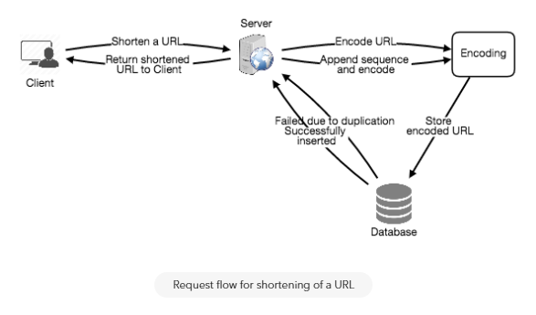
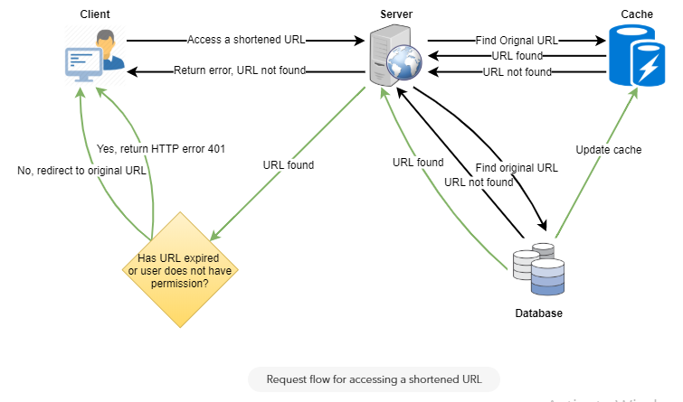

# URL shortner / Tiny URL

### Requirements
##### Functional Requirements

- Given a URL, our service should generate a shorter and unique alias of it.
- When users access a short link, our service should redirect them to the original link.
- Users should optionally be able to pick a custom short link for their URL.
- Links will expire after a standard default timespan.

##### Non-Functional Requirements
- The system should be highly available. This is required because, if our service is down, all the URL redirections will start failing.
- URL redirection should happen in real-time with minimal latency.
- Shortened links should not be guessable (not predictable).

### Capacity planning
##### Traffic
- Read/Write ratio: 100:1
- New URL requests: 500M/month
- URL requests: 500M * 100 = 50 B/month
- Create URL Queries per second (QPS): 500 million / (30 days * 24 hours * 3600 seconds) = ~200 URLs/s
- URL request Queries per second (QPS): 100 * 200 URLs/s = 20K/s
  
##### Storage
- Storage required: Approx URL size * Requests per month * Years to keep data * 12 months = 500 bytes * 500 million * 7 years * 12 months = 21 TB

##### Memory
If we want to cache some of the hot URLs that are frequently accessed, how much memory will we need to store them? If we follow the 80-20 rule, meaning 20% of URLs generate 80% of traffic, we would like to cache these 20% hot URLs.

Since we have 20K requests per second, we will be getting 1.7 billion requests per day:
20K * 3600 seconds * 24 hours = ~1.7 billion

To cache 20% of these requests, we will need 170GB of memory.
0.2 * 1.7 billion * 500 bytes = ~170GB

### Encoding URL
Refer [Base 64](../terminologies/Base-64.md) to understand encoding.
We can compute a unique hash (e.g., MD5 or SHA256, etc.) of the given URL. The hash can then be encoded for displaying. This encoding could be base36 ([a-z ,0-9]) or base62 ([A-Z, a-z, 0-9]) and if we add '-' and '.' we can use base64 encoding. A reasonable question would be, what should be the length of the short key? 6, 8 or 10 characters.

Using base64 encoding, a 6 letter long key would result in 64^6 = ~68.7 billion possible strings
Using base64 encoding, an 8 letter long key would result in 64^8 = ~281 trillion possible strings

With 68.7B unique strings, let’s assume six letter keys would suffice for our system.

### If multiple users enter the same URL?

We can append an increasing sequence number to each input URL to make it unique, and then generate a hash of it. We don’t need to store this sequence number in the databases, though. Possible problems with this approach could be an ever-increasing sequence number.

### What kind of database should we use? 
Since we anticipate storing billions of rows, and we don’t need to use relationships between objects – a NoSQL key-value store like DynamoDB, Cassandra or Riak is a better choice. A NoSQL choice would also be easier to scale. 

### Reference

- https://www.educative.io/collection/page/5668639101419520/5649050225344512/5668600916475904

- https://medium.com/@narengowda/url-shortener-system-design-3db520939a1c

- https://leetcode.com/discuss/interview-question/124658/Design-a-URL-Shortener-(-TinyURL-)-System/

- http://blog.gainlo.co/index.php/2016/03/08/system-design-interview-question-create-tinyurl-system/