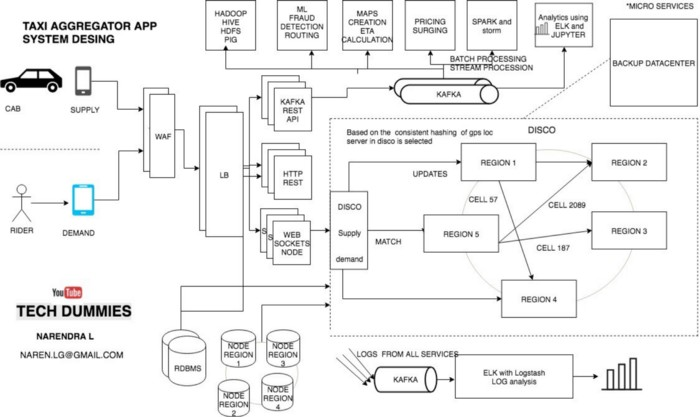

# UBER / OLA / LYFT

Uber is a ride-hailing company that offers the Uber mobile app, which you can use to submit a trip request that is automatically sent to an Uber driver near to you, alerting the driver to your location.

Uber acts like a real-time market platform that matches drivers with riders using mobile phones.
So we need two services, collectively called as dispatch.
- Supply service
- Demand service

### Supply service:
- The Supply Service tracks cars using geolocation (lat and lang) Every cab which is active keep on sending lat-long to the server every 5 sec once
- The state machines of all of the supply also kept in memory
- To track vehicles there are many attributes to model: number of seats, type of vehicle, the presence of a car seat for children, can a wheelchair be fit, and so on.
- Allocation needs to be tracked. A vehicle, for example, may have three seats but two of those are occupied.

### Demand service
- The Demand Service tracks the GPS location of the user when requested
- It tracks requirements of the orders like Does a rider require small car/big car or pool etc
- demand requirements must be matched against supply inventory.

### DISCO — DISPATCH optimization
Now we have supply and demand. all we need a service which matches they demand to a supply and that service in UBER is called as DISCO

GPS/ location data is what drive dispatch system, that means we have to model our maps and location data

- The earth is a sphere. It’s hard to do summarization and approximation based purely on longitude and latitude. So Uber divides the earth into tiny cells using the Google S2 library. Each cell has a unique cell ID.
- S2 can give the coverage for a shape. If you want to draw a circle with a 1km radius centered on London, S2 can tell what cells are needed to completely cover the shape
- When a location comes in from supply the cell ID for the location is determined. 
- To match riders to drivers or just display cars on a map, DISCO sends a request to geo by supply
- When DISCO needs to find the supply near a location, a circle’s worth of coverage is calculated centered on where the rider is located.
- The read load is scaled through the use of replicas. If more read capacity is needed the replica factor can be increased.
- The system filters all cabs by rider’s GPS location data to get nearby cabs that meet riders requirements Using the cell IDs from the circle area all the relevant shards are contacted to return supply data.
- Then the list and requirements are sent to routing / ETA to compute the ETA of how nearby they are not geographically, but by the road system.
- Sort by ETA then sends it back to supply system to offer it to a driver.

### Scaling Dispatch
It uses a ringpop system there are all these Node processes containing ringpop modules. They gossip around the current membership.

Externally, if DISCO wants to consume geospatial, every node is equivalent. A random healthy node is selected. Wherever the request lands is responsible for forwarding the request to the right node by using the hash ring lookup. It looks like:

### Dispatch Availability
Availability matters a lot. Uber has competitors and switching costs are very low. If Uber is down even briefly that money goes to someone else. Other products are more sticky and customers will just try again later. That’s not necessarily true with Uber.

- Make everything **retryable**. If something doesn’t work it has to be retryable. That’s how to route around failure. This requires all requests to be idempotent. Retrying a dispatch, for example, can’t dispatch them twice or charge someone’s credit card twice.

- Make everything **killable**. Failure is a common case. Killing processes randomly shouldn’t do damage.

- **Crash only**. There are no graceful shutdowns. Graceful shutdowns are not what needs to be practiced. What needs to be practiced is when unexpected things break.

- **Small pieces**. To minimize the cost of things failing break them into smaller pieces. It might be possible to handle global traffic in one instance, but what happens when that dies? If there is a pair of them and one fails then capacity is cut in half. So services need to be broken up. It sounds like a technology problem, but it’s more of a cultural problem. It’s just easier to have a pair of databases. It’s a natural thing to do, but pairs are bad. Randomly killing them it’s really risky if you’ll be able to automatically promote one and restart the new secondary.

- **Kill everything**. Even kill all the databases to make sure it’s possible to survive that kind of failure. This required changing decisions about what database to use.They chose Riak instead of MySQL. It also means using ringpop instead of redis. Killing a redis instance is an expensive operation, they are usually pretty big and expensive to have go away.

- Break it up into smaller chunks. Talking about cultural shift. Typically Service A will talke to Service B through a load balancer. What if the load balancer dies? How are you going to deal with it? If you don’t ever exercise that path you’ll never know. So you have to kill the load balancer. How do you route around the load balancer? Load balancing logic has to be put in the service itself. Clients are required to have some intelligence to know how to route around problems. This is philosophically similar to how Finagle works.

- To make the whole system scale and handle back pressure, a service discovery and routing system has be created out of a cluster of ringpop nodes.

### Design diagram

### How booking happens?
- The rider makes a request via websocket and this is landed to the demand service. This request will contain the type of cab and service requests.
- Demand Service now passes this to the Supply service type of cab and nature of drive requested and using Google S2 library passes the cell id of the rider.
- Supply service based on hashing the cell index, finds the server that will have the data related to cabs in this range of cell index. (ie) If user makes request from cell index 5, it finds the server which holds the data for this cell index and makes the call. If there are multiple indexes obtained, supply service talks to one server which functions as master and makes calls to respective all other servers and manages the communication between the servers in the ring via RPC calls.
- The server now draws a circle to find all the cells from where cabs can be figured out. Then based on cabs found, it uses Map Service to find ETA and responds to Supply Service.
- The supply service now sends the request back to the drivers and depending on notification / acknowledgement from driver, allocate the same to the rider.

### How does system track cab location
Every cab will send the location through Web application gateway / firewall , load balancer to the Kafka REST Api which gets consumed to different places as required, database and DISCO to keep the latest cab location. We have different servers in a ring which are assigned responsibilities of different hashed cell index and hence the data is stored accordingly. These servers are in architecture called Ring Pop and they are equally distributed with loads when new servers are added or servers are taken down.

### How supply sends messages and saved?
- Apache Kafka is used as the data hub
- supply or cabs uses Kafka’s APIS to send there accurate GPS locations to the datacenter.
- Once the GPS locations are loaded to Kafka they are slowly persisted to the respective worker notes main memory and also to the DB when the trip is happening.

### How ETAs are calculated?
- Routing and Calculating ETA is important component in uber as it directly impacts ride matching and earnings.
- so it uses historical travel times to calculate ETAs
- you can use AI simulated algorithms or simple Dijkstra's also to find the best route
- Also you can use Driver’s app’s GPS location data to easily predict traffic condition at any given road as there are so many uber cars on the road which is sending GPS locations every 4 seconds

### How To Handle Total Datacenter Failure?
- It doesn’t happen very often, but there could be an unexpected cascading failure or an upstream network provider could fail.
- Uber maintains a backup data center and the switches are in place to route everything over to the backup datacenter.
- The problem is the data for in-process trips may not be in the backup datacenter. Rather than replicate data they use driver phones as a source of trip data.
- What happens is the Dispatch system periodically sends an encrypted State Digest down to driver phones. Now let’s say there’s a datacenter failover. The next time the driver phone sends a location update to the Dispatch system the Dispatch system will detect that it doesn’t know about this trip and ask them for the State Digest. The Dispatch system then updates itself from the State Digest and the trip keeps on going like nothing happened.

### How Maintain the stability of system maintained
All systems publish logs to separate Kafka cluster which can be analyzed and dashboards to enable the monitoring and control of large volume of system in this eco system.

### Where they store data?
Moved from RDBMS to NoSQL DB. This is to ensure horizontal scaling, manage different regions on which they are establishing the services. As each cab sends request every 4 seconds, this will be write heavy application and read heavy application to manage rider request. So in order to enable intense operations with nearly zero downtime irrespective of adding nodes, taking backup or system goes down. They build data center in nearest place to the region they establish to ensure faster response.

### Exaplain Geo Spatial Design - How this is achieved.
- Google S2 libraries - This service is used to identify the location for cab and rider
- Building Maps - Earlier Uber used map-box but now Google Map Framework has been used and also Google Maps API to calculate ETA by collaboration with Google while it was doing on its own earlier.
- Preferred Access points. - For large communities and also university / campus the system cannot come to exact location of rider. So based on the trend of bookings, it learns specific access points which are being used by riders and learns to recommend the same back to the rider.

### Tech Stack
- Node.js
- Python
- Java
- Go
- Native applications on iOS and Android
- Microservices
- Redis
- Postgres
- MySQL
- Riak
- Twitter’s Twemproxy for Redis
- Google's S2 Geometry Library
- ringpop - consistent hash ring
- TChannel - network multiplexing and framing protocol for RPC
- Thrift

## References:

- https://www.linkedin.com/pulse/uber-system-design-demysified-rajesh-s/
- https://medium.com/@narengowda/uber-system-design-8b2bc95e2cfe
- http://highscalability.com/blog/2015/9/14/how-uber-scales-their-real-time-market-platform.html